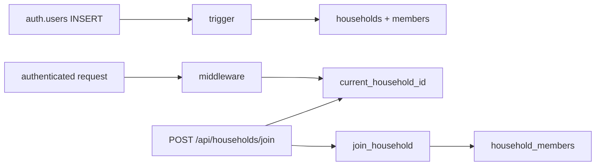

# Household data model and RLS policies — Plan Brief

> Full plan: `context/changes/household-data-scaffold/plan.md`

## What & Why

Every later slice (pantry, recipes, matching) must query by household so pantry and recipes never leak across families. F-01 lands that isolation primitive: tables, RLS, auto-assign on signup, and a way for a second person to join.

## Starting Point

The app has Supabase Auth (cookie SSR, signin/signup/dashboard) and no application schema. Signup only creates an Auth user and redirects to confirm-email. Middleware knows `user`, not household.

## Desired End State

A signed-in user always has at least one household, `locals.householdId` for the active one, and a dashboard invite code. Another signed-in user can join via that code. Pantry UI is still later.

## Key Decisions Made

| Decision | Choice | Why (1 sentence) |
| ------------------------------ | ----------------- | ----------------- |
| Membership cardinality | Many households per user | User override; sharing plus a personal household at once. |
| Invite/join in F-01 | Yes, invite codes | User wanted join in this foundation, not a later slice. |
| Household creation | Trigger on `auth.users` | Signup has no session; OAuth later would miss an API-only insert. |
| Existing users | Backfill in the same migration | Login users must satisfy the same invariant. |
| Current household | HttpOnly cookie, default oldest; join switches | No switcher UI; join would feel broken if cookie stayed on the old household. |
| Invite mechanism | Unguessable `invite_code` on household | No email infra; any member can share (no owner role). |
| Isolation proof | Deferred to S-01 | No test runner; no pantry table yet to leak. |
| Extra households | Signup trigger only; UI cannot create more | Foundation stays small; empty personal households after joining are OK. |

## Scope

**In scope:**
- `households` + `household_members` (many-to-many)
- RLS, signup trigger, Auth-user backfill
- `join_household` RPC, `/join`, dashboard code display
- `current_household_id` cookie + `locals.householdId`
- Generated `Database` types + typed client

**Out of scope:**
- Pantry/recipes/matching, switcher, leave/delete/merge, owner/admin, email invites, pgTAP, OAuth

## Architecture / Approach

Postgres owns writes that Auth cannot do in the app (trigger + definer RPC). The Astro middleware reads memberships and sets a cookie. Join is one POST that calls `join_household` then updates the cookie. Members see `invite_code` only via RLS SELECT on households they belong to — never a public lookup-by-code.

## Phases at a Glance

| Phase | What it delivers | Key risk |
| --------- | ----------------------- | ------------------------- |
| 1. Schema | Tables, RLS, trigger, backfill, types | Join/select policies too open or too tight |
| 2. Cookie | `locals.householdId` | Stale/tampered cookie pointing at the wrong household |
| 3. Join UX | Code on dashboard + `/join` | Redeem without a definer RPC (RLS chicken-and-egg) |

**Prerequisites:** Local or linked Supabase (`npx supabase start` or `db push`); existing Auth env vars.
**Estimated effort:** ~2–3 sessions across 3 phases.

## Open Risks & Assumptions

- Users who both sign up and join a partner household keep an unused personal household; no merge in v1.
- Isolation is not demonstrated until S-01; a bad policy can ship until then.
- `config.toml` seed path may need an empty `seed.sql` so `db reset` does not fail.

## Success Criteria (Summary)

- Every Auth user has a household without extra signup-route logic
- Logged-in pages can trust `locals.householdId`
- A second user can join with a code and start acting on that household
